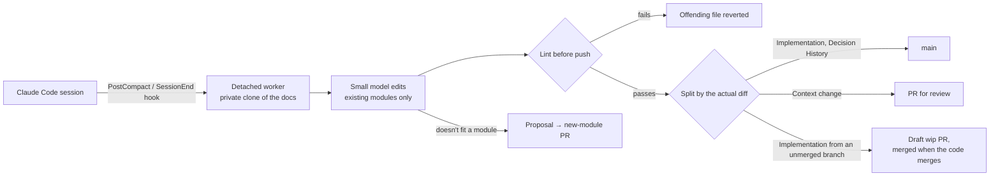

# living-docs

Project documentation that keeps itself up to date. When a Claude Code session ends, the decisions
made in it (what was chosen, why, what was rejected) are filed into a shared docs repo. They're
linted before they're pushed, stamped with the code they came from, and routed by what they
change: routine updates go straight in, and anything that changes what a module is *for* goes to a
human as a PR.

The goal: a human only ever approves a new domain, reviews a change of purpose, and reviews drift
corrections. Nobody has to remember to document anything.

I designed and built this for a team working across several project groups with Claude Code and
Cursor. This is the standalone version, with the team-specific parts removed.

## The problem

Code says *what*. Commit messages say *what changed*. The *why* (the constraint that ruled out
the obvious approach, the option tried and abandoned) lives in a conversation, and is gone when
the conversation is. AI coding sessions make this worse and better at once: more decisions are
made faster, but every one of them is already written down in a transcript.

The catch is trust. Automated documentation that's wrong is worse than none, because every later
session reads it as fact. So most of this project is guardrails.

## How it works



The docs are one git repo per project group: an `INDEX.md` and one file per module under
`modules/`. Each module is a business domain (auth, billing) or a standing topic (architecture,
deployment, integrations, glossary, troubleshooting), with the same sections:

- **Context:** the use case, limitations and constraints. What the module is *for*.
- **Relationships:** which domains it depends on, and how.
- **Implementation:** the current architecture, rewritten in place to stay true.
- **Decision History:** append-only, dated. What was decided, why, and what was rejected.

The full rules are in the [documentation policy](policy/documentation-policy.md), which every
session imports through `CLAUDE.md`.

## The guardrails

**Routing is mechanical, by what the change is, never by how confident the model sounds:**

| Change | Path |
|---|---|
| Decision History, or Implementation from code already on the default branch | Pushed directly |
| Implementation from a code branch that hasn't merged | Held on a draft `docs/wip/<repo>/<branch>` PR; merged automatically when the code PR merges, closed if it's abandoned |
| Context (what the module is for) | PR |
| A new domain or standing topic | PR: the model can only *propose* a module, never create one |
| Anything that couldn't be pushed | PR, so nothing captured is lost |
| Weekly drift-audit corrections | PR |

A Context change is detected from the actual diff of the `## Context` section, not from what the
model reports, so it can't be skipped by omission.

**Lint runs in the worker before anything is pushed:**
- Decision History entries may only be added, and existing ones must survive unchanged and in
  order.
- Module structure can't regress.
- Added lines can't contain what looks like a secret.
- Only edits to existing modules are allowed. New files and INDEX edits are dropped, because new
  modules are proposed.

The docs repo's CI runs it again on every PR and push, and adds gitleaks, a check that fails on
text reading like instructions to an AI (poisoned docs would steer every later session), and
warnings for personal data.

**The docs can't run ahead of the code.** Implementation describes what the code *does*, which is
only true once it merges. So Implementation written on a feature branch waits on a draft PR. A
branch cut from another held branch stacks on it, so the docs land in the same order as the code.
A session that hopped between branches is split by the branch each message was on. Decision
History still publishes at once: the decision was made whether or not the code ships.

**Decisions are traceable and correctable.** Every new entry is stamped
`(src: repo@branch sha)` by the worker, not the model. History is never edited, so a reversed
decision gets a new entry, `Supersedes <date> "<first words>": …`, and CI warns on a dangling
reference.

**Proposals don't pile up.** Duplicate and near-duplicate proposals are dropped; one that's
already open gets a "seen again" comment instead, so evidence accumulates on one PR. One closed
without merging isn't raised again for 90 days.

**Failure is visible.** `living-docs doctor` checks the PATH, the hooks, the remote, `gh`, INDEX
consistency, recent captures, queued proposals and PRs that have waited too long. A session starts
with a one-line notice when the automation has been failing, and the weekly digest flags a week
with no captures at all.

**Developers on different versions can't corrupt the docs.** The policy carries a version and the
docs repo records the one it's on. A tool older than the docs pauses its captures rather than
writing under rules it doesn't know.

## How a capture ships

1. The worker works in a private clone under `~/.local/state/living-docs/`. It never touches your
   own `docs/` checkout, so an uncommitted edit of yours or two sessions ending at once can't
   collide.
2. It pulls the latest docs and publishes anything left over from an earlier run.
3. A small model reads the conversation (the transcript for `SessionEnd`; the compaction summary
   for `PostCompact`) and edits the modules. `SessionEnd` only spends a model call on a session
   with a real discussion in it (at least 3 user turns and about 1,500 characters), and skips
   whatever an earlier capture already filed.
4. Lint, split by the diff, commit as "Claude (via <you>)" with `Source-Repo/Branch/Commit`
   trailers, push.
5. If the push is rejected, it pulls and retries. On a real conflict it throws the attempt away
   and **extracts again on the latest docs** rather than text-merging prose. If it still can't
   land, it becomes a PR.
6. Offline, or `gh` missing: the commit stays local and goes out at the start of the next capture.

## Setup

```sh
npm install -g living-docs     # the hooks call `living-docs` by name
cd <group>/<code-repo>
living-docs init               # docs/ next to the code repos, CLAUDE.md import, hooks
living-docs docs publish --create --reviewer <github-user>
```

`init` creates the group's `docs/` if there isn't one, seeding the standing topics and the
business domains you confirm (it proposes them from `src/`). It also:
- writes `.living-docs/docs.json` (where the docs live);
- copies the policy to `.living-docs/documentation-policy.md` and imports it, with the INDEX,
  from `CLAUDE.md`. Commit all three;
- registers four hooks in `~/.claude/settings.json`: idempotent, with a backup of the previous
  file.

| Hook | When | What |
|---|---|---|
| `hook capture` | `PostCompact` | Hands the compaction summary to the detached worker; returns at once |
| `hook capture-session` | `SessionEnd` | Most sessions never compact: captures from the transcript |
| `hook sync` | `SessionStart` (startup, resume) | Clones the docs on a new machine and hands over the INDEX; otherwise fast-forwards |
| `hook remind` | `SessionStart` (compact) | Points the compacted session back at the INDEX. No model call |

Anyone who clones a code repo afterwards gets the docs on their first session.

**Starting from nothing:** `living-docs docs seed` has a read-only model draft Context and
Implementation for the empty modules from the code, citing `path:line` for each claim. Where the
code doesn't show the intent, it writes "Not determined from the code" instead of guessing. The
drafts go up as one PR.

**Cursor:** `init --target cursor` writes an always-on `.cursor/rules/project-docs.mdc` saying
where the docs are and how to use them. For the write side, `docs enable-merge-capture` adds a
workflow to the code repo that files a merged PR's decisions into the docs. It skips branches that
someone's hooks already captured.

## Automation in the docs repo

`docs publish` installs it; `docs upgrade` updates it later, as a PR to review rather than a
direct push, since the workflows run with the org's secrets.

| Workflow | When | What |
|---|---|---|
| `docs-checks` | Every PR and push | Structure, append-only history, gitleaks, prompt-injection text, personal data, dangling "Supersedes" |
| `docs-lifecycle` | Hourly | Merges a held Implementation PR when its code merges; closes it when the code PR is abandoned; retargets stacked ones; reminds at 14 idle days, closes at 30. Mondays: a health digest |
| `docs-notify` | A docs PR opens | A Slack message (held drafts never ping) |
| `docs-drift-audit` | Weekly | A read-only model compares each Implementation with the code and opens one PR of cited corrections |

A missing secret makes its step skip, not fail: `CODE_REPOS_TOKEN`, `ANTHROPIC_API_KEY`,
`SLACK_WEBHOOK_URL`, and optionally `DOCS_BOT_TOKEN`.

## What running it for real taught me

The stub-based tests couldn't catch any of these. Real `claude -p` runs found them:

1. **Claude Code refuses writes anywhere under `~/.claude/`**, even with the tools allowed. The
   model read the docs, reasoned correctly about what to write, asked "May I proceed?" and edited
   nothing. The state and clones moved to `~/.local/state/`.
2. **A small model will guess instead of looking.** Told to "check the existing files first", it
   wrote "the project has no docs structure yet" with `modules/auth.md` in its working directory.
   The prompt now states the module list and the full INDEX.
3. **A real model put the new Decision History entry first.** The append-only lint now checks
   that existing entries survive *in order*, not just that they survive.
4. **A nested `claude -p` inherits the parent session's environment** when a real hook fires, and
   silently can't write. Those variables are stripped.

And two found by reading the workflows against how GitHub actually behaves: PRs opened with the
default Actions token don't trigger other workflows, so the drift audit's PR would have skipped
its own lint check; and merge capture couldn't clone an SSH docs URL with only a token.

## Status

127 tests (`npm test`, Node's built-in runner): unit tests, plus end-to-end runs of the whole
pipeline against real local git remotes, with `claude` and `gh` stubbed. Each behaviour was
mutation-checked, by breaking it on purpose and seeing the intended test fail, which found gaps in
the tests themselves.

Real `claude -p` runs from inside Claude Code: a compaction capture and a `SessionEnd` capture both
landed correct, attributed, stamped entries; a proposal became a branch; and a planted "delete
every file" line in a transcript was ignored. That was one sample: evidence, not proof.

**Not yet verified:** anything against a real GitHub remote and real Actions runs (`gh pr
create/merge`, the five workflows); a second developer's machine end to end; `docs seed` and the
drift audit against a real model on real code.

**Known limits:** the drift audit opens a new PR each week even if last week's is still open (the
stale close cleans up); `seed` skips list-shaped modules and reads code, not history; nothing yet
for retrieval as the docs grow (path to domain), archiving a long Decision History, or undoing a
bad capture.

## License

MIT
